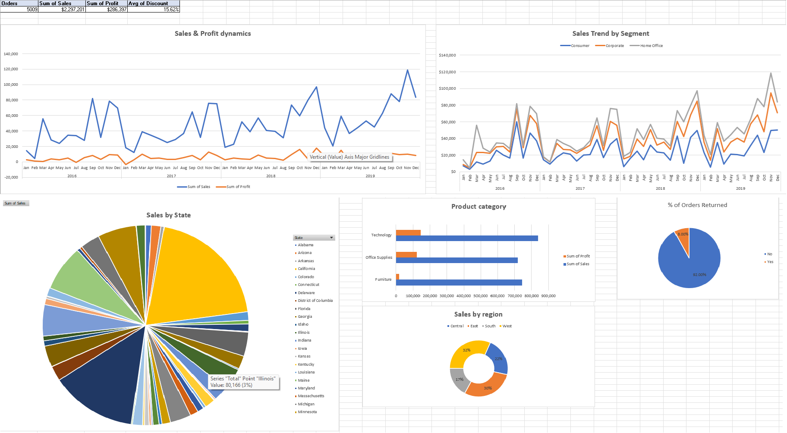

# HomeWork for Module 1

## Installing GitHub and Creating a Repository

At the beginning of the Data Learn course, I already had a GitHub profile and was familiar with some functionality. 
Therefore, I created a new repository, where the solutions for each module will be stored in separate folders.

## Tasks with Sample - Superstore.xls

Using the provided dataset (Sample - Superstore.xls), the following tasks were completed:

 - Applied lookup functions

 - Built PivotTables

 - Generated sample reports

 - Designed interactive dashboards

